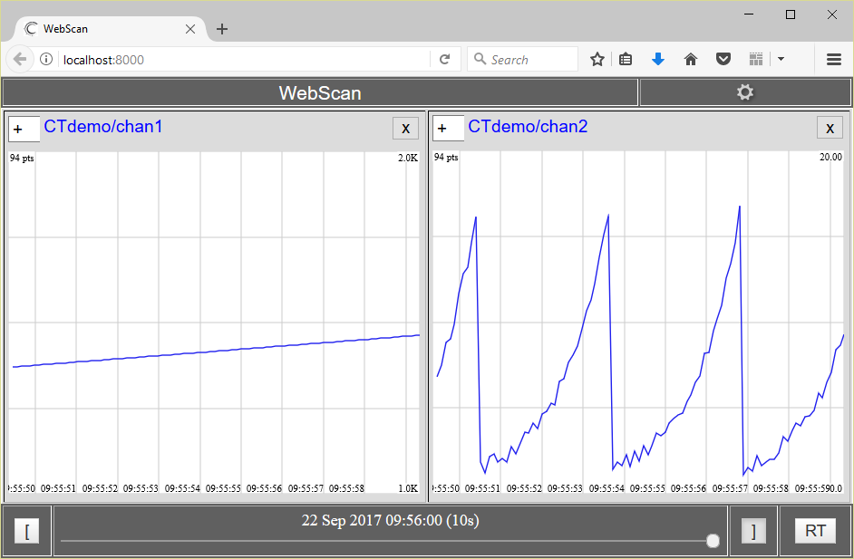

# CTwriter
A simple .NET library developed in C# which writes floating-point data in CloudTurbine format.

Class documentation is available at https://jpw-erigo.github.io/CT_dotNET/class_c_t__dot_n_e_t_1_1_c_t__dot_n_e_t.html

Notes on using this library:

* An array of channel names is given to the class constructor.  A corresponding data array must be given to each putData() call.  For example, if channel �foo.csv� is at index=3 in the channel name array given to the constructor, then data for channel �foo.csv� must be at index=3 in the data array given to putData().  The same number of entries must be supplied in the channel name array as in the data arrays.

* Only double-precision floating point data is currently supported.

* Timestamps are automatically supplied; they can either be in milliseconds or seconds, as specified by a boolean argument to the constructor.

For details on CloudTurbine, see http://www.cloudturbine.com/ and https://github.com/cycronix/cloudturbine.

To compile and use this library:

* Make a local clone of this GitHub repository (https://github.com/jpw-erigo/CT_dotNET.git)

* Compile the library (I used Microsoft Visual Studio Express 2015 for Windows Desktop); perform a Release build to compile the library; the dll should be located at "<install_dir>\bin\Release\CTwriter.dll".

* Use the simple C# program shown below to try out the library.  Create a new "Console application" project; make sure to add a Reference in the project to the compiled library, CTwriter.dll.

A C# example which calls the CTwriter library is shown below.

```C#
//
// Use the CTwriter library to write data out in CloudTurbine format.
//
// This sample program writes out 2 channels:
//   o "chan1.csv" (contains an incrementing index)
//   o "chan2.csv" (waveform with random noise)
//
// The period between samples (in msec) is specified by DATA_PERIOD_MSEC.
//
// Each output file ("chan1.csv" and "chan2.csv") contains the number of points
// specified by NUM_PTS_PER_CT_FILE in CSV format.
//
// Each output CloudTurbine "block" contains one output file per channel; i.e.,
// each block will contain one "chan1.csv" file and one "chan2.csv" file.
// The number of blocks per segment is specified by numBlocksPerSegment.
// For information on the CloudTurbine file hierarchy, see
// http://www.cloudturbine.com/structure/.
//

using System;
using System.IO;
using System.Threading;

namespace CTdemo
{
    class CTdemo
    {
        static void Main(string[] args)
        {
            // Configure the CloudTurbine writer
            int numCTChans = 2;
            String[] ctChanNames = new String[numCTChans];
            ctChanNames[0] = "chan1.csv";
            ctChanNames[1] = "chan2.csv";
            double[] ctChanData = new double[numCTChans];
            int DATA_PERIOD_MSEC = 100;      // Period between data points
            int NUM_PTS_PER_CT_FILE = 10;    // Number of points per channel per file
            int numBlocksPerSegment = 10;
            String baseCTOutputFolder = ".\\CTdata\\CTdemo\\";
            CTwriter.CTwriter ctFile =
                new CTwriter.CTwriter(baseCTOutputFolder, ctChanNames, numBlocksPerSegment, true);

            // To add a random element to chan2.csv
            Random rnd = new Random();

            // Write data to the CloudTurbine source
            for (int i = 0; i < 10000; ++i)
            {
                ctChanData[0] = (double)i;
                ctChanData[1] = Math.Pow(1.1, (double)(i % 30)) + rnd.NextDouble();
                ctFile.putData(ctChanData);
                if ((i % NUM_PTS_PER_CT_FILE) == 0)
                {
                    Console.Write("\n");
                    // Close the data block by calling flush()
                    try
                    {
                        ctFile.flush();
                    }
                    catch (IOException ioe)
                    {
                        Console.WriteLine("\nCaught IOException from CT library on flush");
                        if (ioe.Source != null)
                        {
                            Console.WriteLine("IOException source: {0}", ioe.Source);
                        }
                    }
                }
                Console.Write(".");
                Thread.Sleep(DATA_PERIOD_MSEC);
            }

            // Close the CloudTurbine writer
            try
            {
                ctFile.close();
            }
            catch (IOException ioe)
            {
                Console.WriteLine("\nCaught IOException from CT library on close");
                if (ioe.Source != null)
                {
                    Console.WriteLine("IOException source: {0}", ioe.Source);
                }
            }
        }
    }
}
```

A screenshot of data from this sample application displayed using WebScan/CTweb is shown below:


