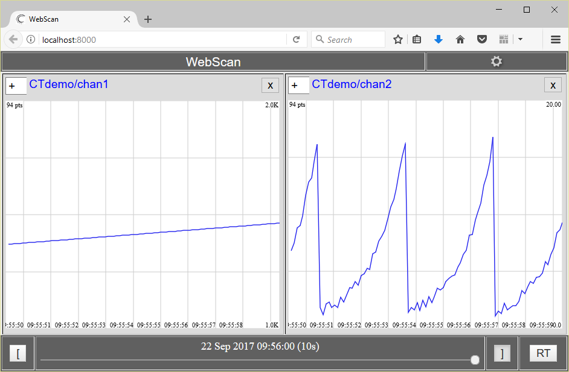

# CT_dotNET
A simple Windows library project which writes floating-point data out in CloudTurbine format.

An array of channel names is given to the class constructor.  The same number of entries must be supplied in the data array given to method putData(); there should be a one-to-one correspondance between the channel name index and the index in the data array.

Only double-precision floating point data is currently supported.

Timestamps can either be in milliseconds or seconds, as specified by the boolean argument to the constructor.

For details on CloudTurbine, see http://www.cloudturbine.com/ and https://github.com/cycronix/cloudturbine.

To compile and use this library:

Make a local clone of this GitHub repository (https://github.com/jpw-erigo/CT_dotNET.git)

Compile the library (I used "Express 2015 for Windows Desktop"); perform a Release build to compile the library; the dll should be located at "<install_dir>\bin\Release\CT_dotNET.dll".

You can use the simple C# program shown below to test the library.  Create a new "Console application" project; make sure to add a Reference in the project to the compiled library, CT_dotNET.dll.

Here's an example application:

```C#
/*
Copyright 2017 Erigo Technologies LLC

Licensed under the Apache License, Version 2.0 (the "License");
you may not use this file except in compliance with the License.
You may obtain a copy of the License at

    http://www.apache.org/licenses/LICENSE-2.0

Unless required by applicable law or agreed to in writing, software
distributed under the License is distributed on an "AS IS" BASIS,
WITHOUT WARRANTIES OR CONDITIONS OF ANY KIND, either express or implied.
See the License for the specific language governing permissions and
limitations under the License.
*/

using System;
using System.IO;
using System.Threading;

namespace CTdemo
{
    class CTdemo
    {
        static void Main(string[] args)
        {
            // Configure the CloudTurbine writer
            int numCTChans = 2;
            String[] ctChanNames = new String[numCTChans];
            ctChanNames[0] = "chan1.csv";
            ctChanNames[1] = "chan2.csv";
            double[] ctChanData = new double[numCTChans];
            int DATA_PERIOD_MSEC = 100;      // Period between data points
            int NUM_PTS_PER_CT_FILE = 10;    // Number of points per channel file
            int numBlocksPerSegment = 10;
            String baseCTOutputFolder = ".\\CTdata\\CTdemo\\";
            CT_dotNET.CT_dotNET ctFile = new CT_dotNET.CT_dotNET(baseCTOutputFolder, ctChanNames, numBlocksPerSegment,true);

            // TO help generating data
            Random rnd = new Random();

            // Write data to the CloudTurbine source
            for (int i = 0; i < 10000; ++i)
            {
                ctChanData[0] = (double)i;
                ctChanData[1] = Math.Pow(1.1, (double)(i % 30)) + rnd.NextDouble();
                ctFile.putData(ctChanData);
                if ((i % NUM_PTS_PER_CT_FILE) == 0)
                {
                    Console.Write("\n");
                    // Close the data block by calling flush()
                    try
                    {
                        ctFile.flush();
                    }
                    catch (IOException ioe)
                    {
                        Console.WriteLine("\nCaught IOException from CT library on flush");
                        if (ioe.Source != null)
                        {
                            Console.WriteLine("IOException source: {0}", ioe.Source);
                        }
                    }
                }
                Console.Write(".");
                Thread.Sleep(DATA_PERIOD_MSEC);
            }

            // Close the CloudTurbine writer
            try
            {
                ctFile.close();
            }
            catch (IOException ioe)
            {
                Console.WriteLine("\nCaught IOException from CT library on close");
                if (ioe.Source != null)
                {
                    Console.WriteLine("IOException source: {0}", ioe.Source);
                }
            }


        }
    }
}
```

Here's a screenshot of the data from this sample application displayed using WebScan/CTweb:



