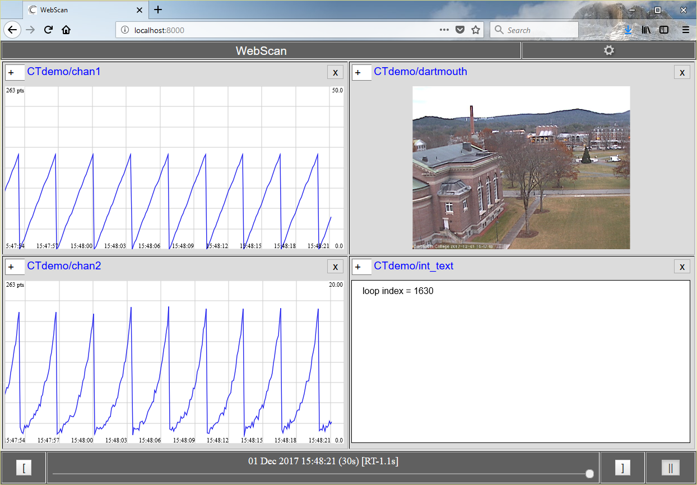

# CTlib_csharp
A simple CloudTurbine library written in C#.

CTwriter is currently supported; see the class documentation at https://jpw-erigo.github.io/CTlib_csharp/namespace_c_tlib.html

CTwriter notes:

* Supports various data types: byte arrays, double, float, long, int, short, char and string.

* Data can optionally be CSV-packed and/or ZIP'ed at the block level.

* Timestamps can be supplied by the user or automatically generated; they can either be in milliseconds or seconds format.

* Write data to local file system or HTTP server (HTTP PUT).

* When writing to local file system (not HTTP output):
    * Old data can optionally be deleted from an existing source folder at startup.
    * An optional "trim" feature maintains only the newest desired number of output segment-level data folders (older data folders will be deleted).

* HTTP mode supports optional username/password login.

* Flushing data (writing out the data block as CT files) can be done synchronously or asynchronously (in the background).

For details on CloudTurbine, see http://www.cloudturbine.com/ and https://github.com/cycronix/cloudturbine.

To compile and use this library:

* Make a local clone of this GitHub repository (https://github.com/jpw-erigo/CTlib_csharp.git)

* Compile the library; I used Microsoft Visual Studio Express 2015 for Windows Desktop.  Set the project's Target framework to .NET Framework 4.5 or later when compiling.  After performing a Release build, the library should be located at "<install_dir>\bin\Release\CTlib.dll".

* Use the simple C# program shown below to try out the library.  Create a new "Console application" project in Visual Studio; add a Reference in the project to the compiled library, CTlib.dll.

A C# example which uses the CTwriter or CThttp class from the CTlib.dll library is shown below.

```C#
//
// Use the CTwriter class from the C# CTlib library to write data out in
// CloudTurbine format.
//
// The period between samples (in msec) is specified by dataPeriodMsec.
//
// The number of loop iterations between calls to flush is set by
// numLoopsPerBlock; thus, we will call flush approximagely every
// dataPeriodMsec * numLoopsPerBlock msec.
//
// The number of blocks per segment is specified by numBlocksPerSegment.
// Set this to 0 to not have a segment layer.
//
// When using standard CTwriter (ie, not CThttp): The desired number of
// segment folders is specified by numSegmentsToKeep. Older segment
// folders are deleted. To keep all segment folders, set this value to 0.
//
// To startup in HTTP PUT mode:
//     CTdemo.exe  <source_name>  http
//
// For further information on C#/CTlib implementation:
// http://www.cloudturbine.com/ctlib_csharp/
//
// For information on the CloudTurbine file hierarchy:
// http://www.cloudturbine.com/structure/
//

using System;
using System.IO;
using System.Net;
using System.Threading;

using CTlib;

namespace CTdemo
{
    class CTdemo
    {
        static byte[] dartmouthImage = null; // image fetched by a separate thread
        static bool bNewImage = false; // for synchronized access to the image

        static void Main(string[] args)
        {
            // Does the user want to use HTTP PUT for writing data?
            bool bHttp = false;

            // Settings for data to be written to CT
            String[] ctChanNames = new String[2];
            ctChanNames[0] = "chan1.csv";
            ctChanNames[1] = "chan2.csv";
            double[] ctChanData = new double[2];
            // Settings for the CloudTurbine writer
            int dataPeriodMsec = 100; // Period between data points
            int numLoopsPerBlock = 10; // Number of loops to perform between calls to flush
            int numBlocksPerSegment = 10; // Number of blocks in each segment (0 for no segment layer)
            int numSegmentsToKeep = 3; // Number of segments to keep, older segment folders are trimmed (0 for no trim, keep all)
            bool bOutputTimesAreMillis = true; // When true, the output time format is milliseconds since epoch
            bool bPack = true; // When true, channel output data files contain multiple points in CSV format
            bool bZip = true; // When true, block-level folders are ZIP'ed
            bool bDeleteOldDataAtStartup = true; // When true, old source data is deleted when the new source starts
            String baseCTOutputFolder = "."; // Output data folder name
            if (args.Length > 0)
            {
                baseCTOutputFolder = args[0];

                if ( (args.Length > 1) && (args[1].Equals("http")) )
                {
                    bHttp = true;
                    // NOTE: When using HTTP PUT method, can't delete any data (either at startup or during the run)
                    numSegmentsToKeep = 0;
                    bDeleteOldDataAtStartup = false;
                }

            }
            Console.WriteLine("\nSource output folder = \"{0}\"\n", baseCTOutputFolder);
            CTwriter ctw = null;
            try
            {
                if (!bHttp)
                {
                    ctw = new CTwriter(baseCTOutputFolder, numBlocksPerSegment, numSegmentsToKeep, bOutputTimesAreMillis, bPack, bZip, bDeleteOldDataAtStartup);
                    ctw.setAsync(true);
                    Console.WriteLine("\nUsing the standard C# CTwriter class");
                }
                else
                {
                    String hostStr = "http://localhost:8000";
                    CThttp cthttp = new CThttp(baseCTOutputFolder, numBlocksPerSegment, bOutputTimesAreMillis, bPack, bZip, hostStr);
                    // Only login when we are writing via HTTPS (eg if hostStr were "https://localhost:8443")
                    // cthttp.login("fee", "foo");
                    ctw = (CTwriter)cthttp;
                    ctw.setAsync(true);
                    Console.WriteLine("\nUsing the C# CThttp class to write data using HTTP PUT");
                }
            }
            catch (Exception e)
            {
                Console.WriteLine("Caught exception trying to create CTwriter:\n{0}", e);
                return;
            }

            // To add a random element to chan2.csv
            Random rnd = new Random();

            // Kick off fetching the first image
            Thread imageThread = new Thread(new ThreadStart(FetchImage));
            imageThread.Start();

            // Write data to the CloudTurbine source
            for (int i = 1; i <= 1000; ++i)
            {
                // Image from Dartmouth College webcam
                if (bNewImage)
                {
                    bNewImage = false;
                    ctw.putData("dartmouth.jpg", dartmouthImage);
                    // Launch thread to fetch another image
                    imageThread = new Thread(new ThreadStart(FetchImage));
                    imageThread.Start();
                }
                double testVal = (double)(i % 30);
                ctChanData[0] = 1.0 * testVal;
                ctChanData[1] = Math.Pow(1.1, (double)(i % 30)) + rnd.NextDouble();
                ctw.putData(ctChanNames, ctChanData);
                ctw.putData("double_binary.f64", 2.0 * testVal);
                ctw.putData("double_csv.csv", 3.0 * testVal);
                ctw.putData("int_binary.i32", i);
                ctw.putData("int_text.txt", String.Format("loop index = {0}", i));
                if ((i % numLoopsPerBlock) == 0)
                {
                    // Close the data block by calling flush()
                    Console.Write("\n");
                    try
                    {
                        ctw.flush();
                    }
                    catch (IOException ioe)
                    {
                        Console.WriteLine("\nCaught IOException from CTwriter on flush:\n{0}", ioe);
                    }
                }
                Console.Write(".");
                Thread.Sleep(dataPeriodMsec);
            }

            // Close the CloudTurbine writer
            try
            {
                ctw.close();
            }
            catch (IOException ioe)
            {
                Console.WriteLine("\nCaught IOException from CT library on close");
                Console.WriteLine(ioe);
                if (ioe.Source != null)
                {
                    Console.WriteLine("IOException source: {0}", ioe.Source);
                }
            }
        }

        static void FetchImage()
        {
            dartmouthImage = null;
            // Pace ourselves...
            Thread.Sleep(750);
            using (var webClient = new WebClient())
            {
                dartmouthImage = webClient.DownloadData("http://wc2.dartmouth.edu/jpg/image.jpg");
            }
            bNewImage = true;
        }
    }
}
```

A screenshot of data from this sample application displayed using WebScan/CTweb is shown below:


